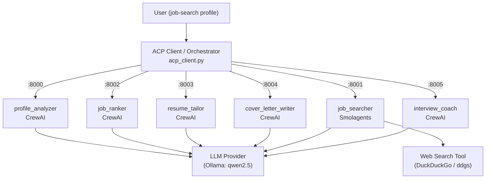

# ACP Multi-Agent Job Search Assistant

A local demo of the **Agent Communication Protocol (ACP)** where six specialized agents —
built with **two different frameworks** (CrewAI and Smolagents) — collaborate to produce a
complete job-search package from a single profile.

You give one job-search profile. A client orchestrates six independent agents, each running on
its own local ACP server, and prints a consolidated report: profile analysis → job search →
ranked matches → skills gap → tailored resume → cover letter → interview prep.

## What this demonstrates

- **Multiple specialized agents** — each does exactly one job and nothing else.
- **ACP interoperability** — agents talk over a shared protocol (`acp_sdk`), not bespoke glue.
- **Mixed frameworks** — CrewAI and Smolagents agents collaborate without knowing each other's
  internals; ACP is the only contract between them.
- **Client-side orchestration** — `acp_client.py` is the coordinator: it calls each agent in
  order and feeds one agent's output into the next.

## Architecture

| Agent | Framework | Server file | Port | Responsibility |
|-------|-----------|-------------|------|----------------|
| `profile_analyzer` | CrewAI | `profile_acp_server.py` | 8000 | Extract a structured profile (role, seniority, location, skills, strengths, constraints, gaps) |
| `job_searcher` | Smolagents | `job_search_acp_server.py` | 8001 | Web-search (DuckDuckGo/ddgs) for 5–10 relevant openings |
| `job_ranker` | CrewAI | `ranking_acp_server.py` | 8002 | Rank jobs vs. the profile; emit scores, concerns, gaps, and a top-job block |
| `resume_tailor` | CrewAI | `resume_acp_server.py` | 8003 | Tailored resume suggestions for the top job (no fabrication) |
| `cover_letter_writer` | CrewAI | `cover_letter_acp_server.py` | 8004 | Draft a cover letter for the top job, with `[Placeholders]` |
| `interview_coach` | CrewAI | `interview_acp_server.py` | 8005 | Interview questions, answer strategies, topics to review, questions to ask |



The agents never call each other directly. The **client** is the only coordinator: it sends the
profile to `profile_analyzer`, the analysis to `job_searcher`, and so on, threading each result
into the next call.

## Setup (Windows / PowerShell)

Requires [uv](https://docs.astral.sh/uv/) and [Ollama](https://ollama.com/). Python is pinned to
**3.12** (CrewAI/ChromaDB currently fail on 3.14; `acp-sdk` needs ≥ 3.11).

```powershell
uv python install 3.12
uv python pin 3.12
uv venv --python 3.12
.venv\Scripts\activate
uv sync
ollama pull qwen2.5:14b
```

Copy the environment template (optional — defaults work out of the box with Ollama):

```powershell
Copy-Item .env.example .env
```

**Model:** every server defaults to `ollama_chat/qwen2.5:14b`. On a weaker machine, switch to the
7B model by setting it in `.env` (`OLLAMA_MODEL=ollama_chat/qwen2.5:7b`) and running
`ollama pull qwen2.5:7b`.

## How to run

Open **seven** PowerShell terminals. In each, activate the venv first
(`.venv\Scripts\activate`), then run one command. Start the six servers first, then the client.

```powershell
# Terminal 1 — profile analyzer   (:8000)
uv run profile_acp_server.py

# Terminal 2 — job searcher        (:8001)
uv run job_search_acp_server.py

# Terminal 3 — job ranker          (:8002)
uv run ranking_acp_server.py

# Terminal 4 — resume tailor       (:8003)
uv run resume_acp_server.py

# Terminal 5 — cover letter writer (:8004)
uv run cover_letter_acp_server.py

# Terminal 6 — interview coach     (:8005)
uv run interview_acp_server.py

# Terminal 7 — the orchestrator (run last, once the six servers are up)
uv run acp_client.py
```

Prefer one command? Use the helper scripts in `scripts/`:

```powershell
# Launch all six servers, each in its own window:
.\scripts\start_all_servers.ps1

# Verify every server is up and exposes its agent:
.\scripts\check_agents.ps1
```

Edit the `USER_PROFILE` constant at the top of `acp_client.py` to run your own search.

## Troubleshooting

- **`No solution found` / CrewAI import errors on Python 3.14** — CrewAI/ChromaDB don't support
  3.14 yet. Use 3.12: `uv python pin 3.12` then `uv venv --python 3.12` and `uv sync`.
- **`AttributeError: ... LoopSetupType`** — a uvicorn version mismatch with `acp-sdk`. This project
  pins `uvicorn==0.35.0`. Verify with:
  `uv run python -c "import uvicorn, uvicorn.config as c; print(uvicorn.__version__, hasattr(c,'LoopSetupType'))"`
  → should print `0.35.0 True`.
- **`ModuleNotFoundError: litellm`** — Smolagents needs the LiteLLM extra. It's included via
  `smolagents[litellm]` and an explicit `litellm` dep; re-run `uv sync`.
- **`ModuleNotFoundError: ddgs` / DuckDuckGo tool errors** — the search backend is `ddgs`; re-run
  `uv sync`. If searches return little, DuckDuckGo may be **rate-limiting** — wait a minute and retry;
  the agent is told to broaden queries rather than fail.
- **`[X] Could not reach '<agent>' on :<port>`** (connection refused) — that agent's server isn't
  running. Start it: `uv run <server_file>.py`. Run `.\scripts\check_agents.ps1` to see which ports
  are live.
- **`<agent> returned no output`** — the agent crashed server-side. Read that server's terminal for
  the real traceback (the client surfaces a clear message instead of an `IndexError`).
- **`model 'qwen2.5:14b' not found`** — pull it: `ollama pull qwen2.5:14b` (or `qwen2.5:7b` and set
  `OLLAMA_MODEL` accordingly). Make sure Ollama is running on `http://localhost:11434`.
- **CrewAI tracing prompt blocks the server** — tracing is hard-disabled in code and `.env.example`
  ships `CREWAI_TRACING_ENABLED=false`. If you maintain your own `.env`, keep it `false`.

## Expected output

The client prints `[1/7]…[7/7]` progress lines, then a consolidated report with these sections:

1. **Candidate Profile Summary** — target role, seniority, location, skills, strengths, gaps.
2. **Job Search Results** — 5–10 openings with company, location/remote, URL, and required skills.
3. **Ranked Jobs** — match scores out of 100, reasons, concerns, missing skills, top 3.
4. **Top Recommended Job** — the single best match.
5. **Resume Tailoring Suggestions** — summary, skills, improved bullets, keywords, warnings.
6. **Cover Letter Draft** — a tailored letter with `[Placeholders]` where info is missing.
7. **Interview Prep Pack** — 8 questions + strategies, 3 topics to review, 3 questions to ask.

> The full run uses a local LLM for every step, so expect it to take a few minutes on the 14B model.
