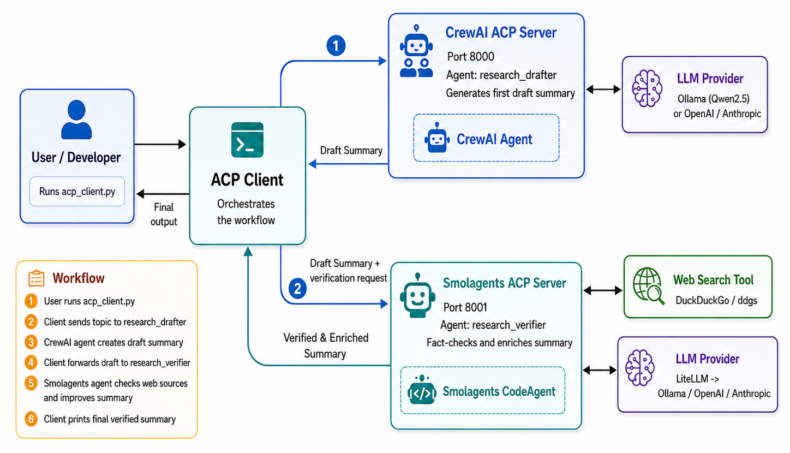

# Summary Generator Multi-Agent Workflow with ACP

A simple demo showing how two agents built with different frameworks can collaborate through the **Agent Communication Protocol (ACP)**.

- **CrewAI agent** generates the first research summary.
- **Smolagents agent** verifies and enriches the summary using web search.
- **ACP client** orchestrates the workflow between both servers.

## Architecture



## Project Structure

```text
Acp demo/
├── acp_client.py
├── crew_acp_server.py
├── smolagents_acp_server.py
├── pyproject.toml
├── uv.lock
├── .venv/
└── acp_workflow_system_architecture_diagram.png
```
    
## Requirements

- Windows 10 or Windows 11
- Python 3.12
- uv
- Ollama
- Qwen2.5 model, or another supported LLM provider

## Setup

Open PowerShell in your project folder:

```powershell
cd "C:\Users\Alienware\Documents\Personal Projects\Acp demo"
```

Install Python 3.12 with uv:

```powershell
uv python install 3.12
uv python pin 3.12
uv venv --python 3.12
.venv\Scripts\activate
```

Install dependencies:

```powershell
uv add acp-sdk crewai "smolagents[litellm]" duckduckgo-search ollama ddgs python-dotenv "uvicorn==0.35.0"
```

Pull the Ollama model:

```powershell
ollama pull qwen2.5:14b
```

If your machine has limited RAM, use a smaller model:

```powershell
ollama pull qwen2.5:7b
```

## Running the Demo

Start each component in a separate PowerShell terminal.

### Terminal 1: Start the CrewAI ACP Server

```powershell
cd "C:\Users\Alienware\Documents\Personal Projects\Acp demo"
.venv\Scripts\activate
uv run crew_acp_server.py
```

Expected server address:

```text
http://127.0.0.1:8000
```

### Terminal 2: Start the Smolagents ACP Server

```powershell
cd "C:\Users\Alienware\Documents\Personal Projects\Acp demo"
.venv\Scripts\activate
uv run smolagents_acp_server.py
```

Expected server address:

```text
http://127.0.0.1:8001
```

### Terminal 3: Run the ACP Client

```powershell
cd "C:\Users\Alienware\Documents\Personal Projects\Acp demo"
.venv\Scripts\activate
uv run acp_client.py
```

## Workflow

1. The user runs `acp_client.py`.
2. The client sends a research topic to the CrewAI ACP server.
3. The `research_drafter` agent creates a draft summary.
4. The client forwards the draft summary to the Smolagents ACP server.
5. The `research_verifier` agent checks and enriches the summary using web search.
6. The client prints the final verified summary.

## Expected Output

The client prints two sections:

```text
Draft Summary:
...

Verified & Enriched Summary:
...
```

## Common Fixes

### `No module named 'ddgs'`

Install the missing search dependency:

```powershell
uv add ddgs
```

### `No module named 'litellm'`

Install the Smolagents LiteLLM extra:

```powershell
uv add "smolagents[litellm]"
```

### `uvicorn.config has no attribute LoopSetupType`

Pin Uvicorn to a compatible version:

```powershell
uv add "uvicorn==0.35.0"
```

### `IndexError: list index out of range`

This usually means one of the ACP agents failed and returned no output. Check the terminal running the failing server for the real error.

## Notes

- Keep both ACP servers running before starting the client.
- Use Python 3.12, not Python 3.14.
- The image file must stay in the same folder as this README for the architecture diagram to render correctly.
